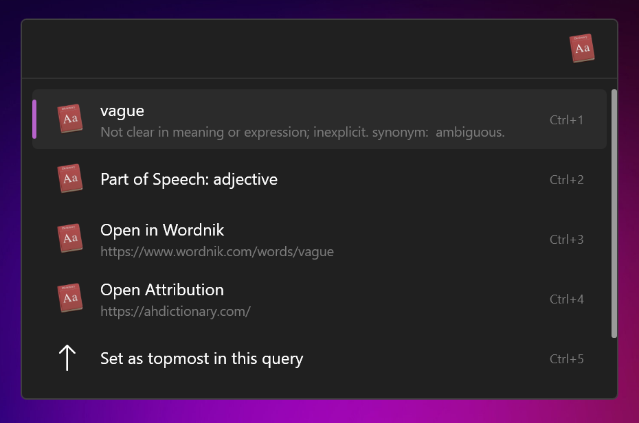

# Flow.Launcher.Plugin.WordNikDictionary
This is a plugin for [Flow Launcher](https://github.com/Flow-Launcher/Flow.Launcher) that lets you easily see the definitions of words using [wordnik](https://wordnik.com).

## Get an API Key
To get an API key, head to [developer.wordnik.com](https://developer.wordnik.com/), and create an account. Once you've created your account, you'll be able to fill out a form to request an api key.

## Features

### Feature List
1. [Get the definition of a word](#get-the-definition-of-a-word)
2. [Get information about definition of a word](#get-information-about-definition-of-a-word)
3. [Search Modifiers](#search-modifiers)
    - [Filter by parts of speech](#filter-by-parts-of-speech)
    - [Get the syllables of a word](#get-the-syllables-of-a-word)
    - [Get similiar word by category](#get-similiar-word-by-category)
4. [Advanced Error Handler](#advanced-error-handler)
    - [Expected Errors](#expected-errors)
    - [Unexpected Errors](#unexpected-errors)

### Get the definition of a word
Get a list of definitions for your word from various sources. Syntax: `def word`

### Get information about definition of a word
Get information about a certain definition, and easy access to the source. This is a context menu that is avalible for all definitions.

### Search Modifiers
You can use search modifiers to filter your results by part of speech, or to get different types of information about a word. Search modifiers have the following syntax: `word!modifier`
#### Filter by parts of speech
You can filter results by parts of speech by inputting the part of speech as a modifier.
Syntax: `word!part_of_speech`.
List of acceptable parts of speech modifiers:
```
noun, adjective, verb, adverb, interjection, pronoun, preposition, abbreviation, affix, article, auxiliary-verb, conjunction, definite-article, family-name, given-name, idiom, imperative, noun-plural, noun-posessive, past-participle, phrasal-prefix, proper-noun, proper-noun-plural, proper-noun-posessive, suffix, verb-intransitive, verb-transitive
```

#### Get the syllables of a word
We can use the `syllables` search modifier to get the syllables of a word. Syntax: `def word!syllables`

#### Get categories of similiar words
To find the categories of avalible similiar words for a given word, use the following command: `def word!similiar`. To see all of the words in a given category, see the section below.

#### Get similiar word by category
To find all of the words that are similiar to a word in a specific category, use the following command: `def word!rel-category`. For a list of avalible categories for a given word, see the above section.


### Advanced Error Handler

#### Expected Errors
Expected errors will return a short, simple, and stylish error message.


#### Unexpected Errors
When unexpected errors occur, our error handler redirects it to the logs and prompts you to notify us by creating a github issue or discord thread with the logfile.
https://github.com/cibere/Flow.Launcher.Plugin.WordNikDictionary/raw/refs/heads/v2/Images/unexpected_error_handler_showcase.mp4