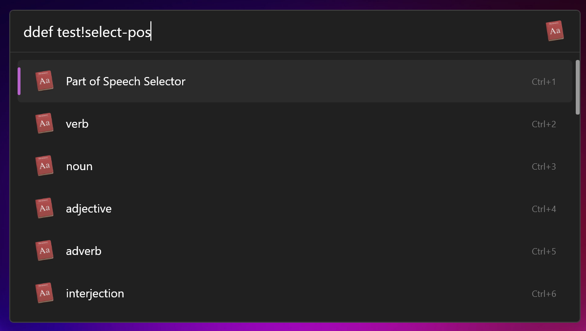
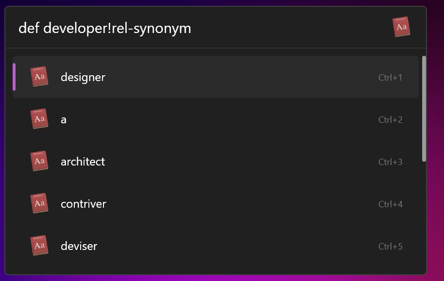
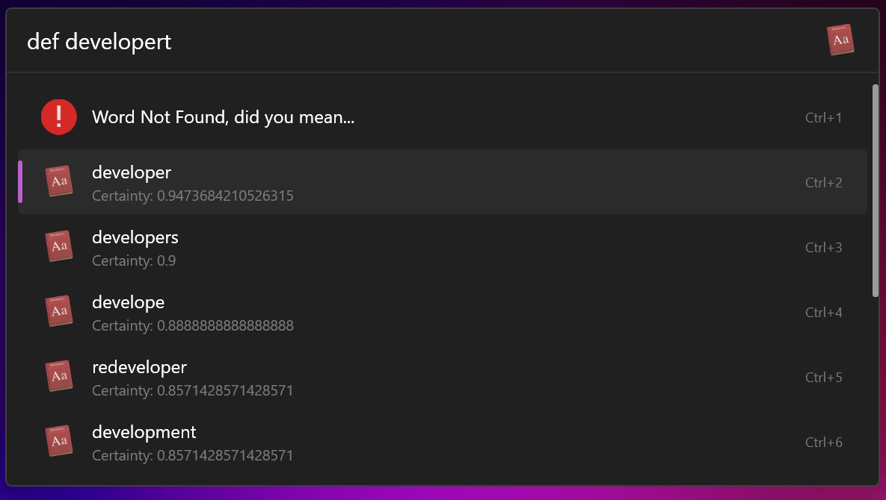

# Flow.Launcher.Plugin.WordNikDictionary
This is a plugin for [Flow Launcher](https://github.com/Flow-Launcher/Flow.Launcher) that lets you easily see the definitions of words using [wordnik](https://wordnik.com).

## Table of Contents
1. [Get an API Key](#get-an-api-key)
2. Installation
    - [Install via Package Manager](#install-via-package-manager)
    - [Manual Installation](#manual-installation)
        - [Install from a previous release](#install-from-a-previous-release)
        - [Download and build development version](#download-and-build-development-version)
3. [Features](#features)
    - [Feature List](#feature-list)

## Get an API Key
To get an API key, head to [developer.wordnik.com](https://developer.wordnik.com/), and create an account. Once you've created your account, you'll be able to fill out a form to request an api key.

## Install via Package Manager

To Install Wordnik Dictionary through Flow's Plugin Manager, run the following command: `pm install wordnik dictionary`.

## Manual Installation
> [!WARNING]
> This method is not recommended, only do this if you know what your doing.
### Install from a previous release

1. Download the zipped release file.

To download a previously released version, head to the [releases page](https://github.com/cibere/Flow.Launcher.Plugin.WordNikDictionary/releases), find the version you want, and download the zip file.

2. Extract the zip file into your plugins folder.

You can access your userdata folder through the `Flow Launcher UserData Folder` command in the system commands plugin, from there go into the `Plugins` folder, and create a new folder for your release. Extract the contents of the zip folder into the new folder you've made.

3. Restart Flow Launcher

Finally you want to restart flow launcher. You can do this via the `Restart Flow Launcher` command in the system commands plugin.

### Download and build development version

1. Head to your plugins folder.

You can access your userdata folder through the `Flow Launcher UserData Folder` command in the system commands plugin, from there go into the `Plugins` folder.

2. Clone the repository.

> [!NOTE]
> [git](https://git-scm.com/) must be installed for this

Now you must clone the repository, which can be done with the following command: `git clone https://github.com/cibere/Flow.Launcher.Plugin.WordNikDictionary`.

3. Setup your environment

Head into the newly created folder containing the plugin, and create and activate a venv. Then run the `install_packages.bat` file from that console. That file will update pip, install the runtime libraries, and install the development libraries.

4. Restart Flow Launcher

Finally you want to restart flow launcher. You can do this via the `Restart Flow Launcher` command in the system commands plugin.


## Features

### Feature List
1. [Get the definition of a word](#get-the-definition-of-a-word)
2. [Get information about definition of a word](#get-information-about-definition-of-a-word)
3. [Search Modifiers](#search-modifiers)
    - [Filter by parts of speech](#filter-by-parts-of-speech)
    - [Parts of Speech Selector](#parts-of-speech-selector)
    - [Get the syllables of a word](#get-the-syllables-of-a-word)
    - [Get similiar word by category](#get-similiar-word-by-category)
    - [Search Modifier Selection Menu](#search-modifier-selection-menu)
4. [Autocomplete Miss-spelled Words](#autocomplete-miss-spelled-words)
5. [Advanced Error Handler](#advanced-error-handler)
    - [Expected Errors](#expected-errors)
    - [Unexpected Errors](#unexpected-errors)
    - [Invalid Search Modifier](#invalid-search-modifier)

### Get the definition of a word
Get a list of definitions for your word from various sources. Syntax: `def word`

### Get information about definition of a word
Get information about a certain definition, and easy access to the source. This is a context menu that is avalible for all definitions.

### Search Modifiers
You can use search modifiers to filter your results by part of speech, or to get different types of information about a word. Search modifiers have the following syntax: `word!modifier`
#### Filter by parts of speech
You can filter results by parts of speech by inputting the part of speech as a modifier.
Syntax: `word!part_of_speech`.
List of acceptable parts of speech modifiers:
```
noun, adjective, verb, adverb, interjection, pronoun, preposition, abbreviation, affix, article, auxiliary-verb, conjunction, definite-article, family-name, given-name, idiom, imperative, noun-plural, noun-posessive, past-participle, phrasal-prefix, proper-noun, proper-noun-plural, proper-noun-posessive, suffix, verb-intransitive, verb-transitive
```

#### Parts of Speech Selector
To select a part of speech from the list of acceptable ones, you can use the `def word!select-pos` command.

#### Get the syllables of a word
We can use the `syllables` search modifier to get the syllables of a word. Syntax: `def word!syllables`

#### Get categories of similiar words
To find the categories of avalible similiar words for a given word, use the following command: `def word!similiar`. To see all of the words in a given category, see the section below.


#### Get similiar word by category
To find all of the words that are similiar to a word in a specific category, use the following command: `def word!rel-category`. For a list of avalible categories for a given word, see the above section.

#### Search Modifier Selection Menu
To see a list of available search modifiers available, use the `def word!select-modifier` command. From there you have quick access to the various modifiers, and the [Parts of Speech Selector Menu](#parts-of-speech-selector).


### Autocomplete Miss-spelled Words
If you misspell a word, wordnik dictionary uses a list of over 370 thousand words to try and figure out what you were trying to spell, and ranks them by how certain it is. Though the source for the list of words and definitions are different! So there may be differences in the data.
> [!NOTE]
> When attempting to use this feature for the first time, you will be prompted to either open up the settings menu to choose the path of a custom word list file, or download one from [dwyl on github](https://github.com/dwyl/english-words).



### Advanced Error Handler

#### Expected Errors
Expected errors will return a short, simple, and stylish error message.


#### Unexpected Errors
When unexpected errors occur, our error handler redirects it to the logs and prompts you to notify us by creating a github issue or discord thread with the logfile.

https://github.com/cibere/Flow.Launcher.Plugin.WordNikDictionary/raw/refs/heads/main/Images/unexpected_error_handler_showcase.mp4

### Invalid Search Modifier
When an invalid advanced search modifier is given, a simple error message is shown, with quick access to the [Search Modifier Selection Menu](#search-modifier-selection-menu)
